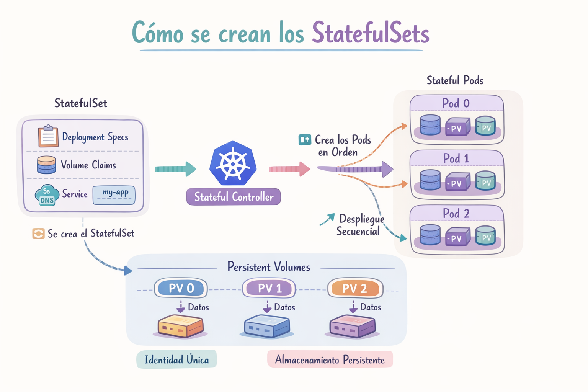

# StatefulSet

Los StatefulSets se utilizan para gestionar aplicaciones con estado que requieren almacenamiento persistente, identificadores de red únicos y estables, y un despliegue y escalado ordenados. Son muy útiles para bases de datos y almacenes de datos que requieren almacenamiento persistente, así como para sistemas distribuidos y aplicaciones basadas en consenso, como etcd y ZooKeeper.

Las bases de datos replicadas son un buen ejemplo de los escenarios que admiten los StatefulSets. Un Pod actúa como nodo principal de la base de datos, gestionando tanto las operaciones de lectura como de escritura, mientras que otros Pods se implementan como réplicas de solo lectura.

Aunque cada Pod puede ejecutar la misma imagen de contenedor, cada uno requiere una configuración especial para determinar si está en modo principal o de solo lectura. Esto significa que cada Pod tiene su propio estado.

Los StatefulSets son valiosos para las aplicaciones que requieren uno o más de los siguientes.

- Identificadores de red estables y únicos.
- Almacenamiento estable y persistente.
- Implementación y escalado ordenados y eficientes.
- Actualizaciones continuas automatizadas y ordenadas.

