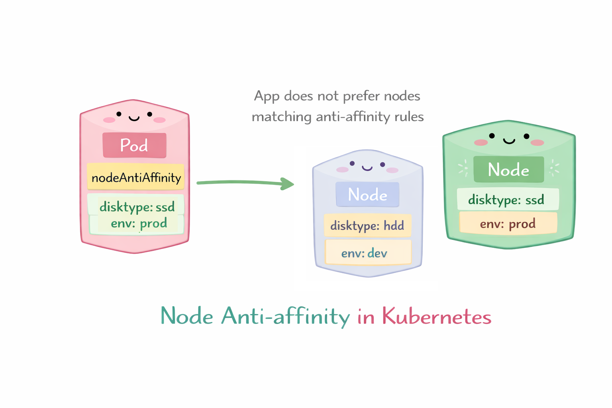

# Scheduling

Es el proceso mediante el cual Kubernetes decide qué nodo (worker node) es el mejor para ejecutar un Pod dentro del cluster.

El proceso de scheduler tiene 3 pasos
+ **Filtrado (Predicados):** El scheduler filtra todos los nodos del clúster para encontrar aquellos que puedan ejecutar el pod. Comprueba la disponibilidad de recursos (CPU, memoria), los selectores de nodos, las tolerancias y las reglas de afinidad. Si no se encuentran nodos, el pod permanece sin programar.
+ **Puntuación (Prioridades):** El scheduler clasifica los nodos viables restantes según las reglas de puntuación para determinar el mejor candidato. Los factores incluyen la capacidad libre suficiente (menos solicitada) o la ubicación de la imagen.
+ **Vinculación (Selección de Nodos):** El scheduler selecciona el nodo con la puntuación más alta y envía esta información al servidor de API mediante un proceso denominado vinculación, actualizando así la especificación del pod.

En resumen el kube-scheduler:

1. Detecta Pods que no tienen nodo asignado
2. Evalua los nodos disponibles
3. Elege el mejor nodo posible
4. Asigna el Pod a ese nodo

La ubicación de los pods se puede controlar mediante el nodeName, los selectors de nodo, las affinities y taints/tolerations.

## NodeName

Puedes especificar el nodeName en el spec del pod. Esto hara que el pod se coloque en el nodo con ese nombre.

<p align="center">

</p>

```yaml
apiVersion: v1
kind: Pod
metadata:
  name: pod-en-nodo-especifico
spec:
  nodeName: node1   # Nombre exacto del nodo
  containers:
  - name: nginx
    image: nginx:latest
    ports:
    - containerPort: 80
```
## NodeSelector

Puedes especificar el nodeSelector en el spec del pod. Esto hara que el pod se coloque en cualquier nodo con esa etiqueta.

<p align="center">

</p>

```yaml
apiVersion: v1
kind: Pod
metadata:
  name: pod-con-nodeselector
spec:
  nodeSelector:
    disktype: ssd   # Etiqueta del nodo
  containers:
  - name: nginx
    image: nginx:latest
    ports:
    - containerPort: 80
```

## Node Affinity y Anti-affinity

De forma similar a nodeSelector, proporciona un mayor control en la selección de nodos utilizando operadores lógicos para seleccionarlos.

### Node Affinity

Garantiza que los pods se programen en nodos con etiquetas específicas.

<p align="center">

</p>

Ejemplo:

```yaml
apiVersion: v1
kind: Pod
metadata:
  name: pod-con-node-affinity
spec:
  affinity:
    nodeAffinity:
      requiredDuringSchedulingIgnoredDuringExecution:
        nodeSelectorTerms:
        - matchExpressions:
          - key: disktype
            operator: In
            values:
            - ssd
      preferredDuringSchedulingIgnoredDuringExecution:
      - weight: 1
        preference:
          matchExpressions:
          - key: env
            operator: In
            values:
            - prod
  containers:
  - name: nginx
    image: nginx:latest
    ports:
    - containerPort: 80
```

- Utilice operadores como In, Exists, Gt, Lt
- Regla obligatoria (required...)
  - El Pod solo se programará en nodos que tengan: disktype=ssd
- Regla preferida (preferred...)
  - Kubernetes intentará usar nodos que tengan: env=prod, pero no es obligatorio
  
### Node Anti-affinity

Garantiza que los pods no se programen en nodos con etiquetas específicas.

<p align="center">

</p>

```yaml
apiVersion: v1
kind: Pod
metadata:
  name: pod-con-node-anti-affinity
spec:
  affinity:
    nodeAffinity:
      requiredDuringSchedulingIgnoredDuringExecution:
        nodeSelectorTerms:
        - matchExpressions:
          - key: disktype
            operator: NotIn
            values:
            - hdd
      preferredDuringSchedulingIgnoredDuringExecution:
      - weight: 1
        preference:
          matchExpressions:
          - key: env
            operator: NotIn
            values:
            - prod
  containers:
  - name: nginx
    image: nginx:latest
    ports:
    - containerPort: 80
```

- Utilice operadores como NotIn, DoesNotExist, Gt, Lt
- Regla obligatoria (required...)
  - El Pod NO se programará en nodos con:: disktype=ssd
- Regla preferida (preferred...)
  - Kubernetes evitara nodos que tengan: env=prod, pero no es obligatorio
  
