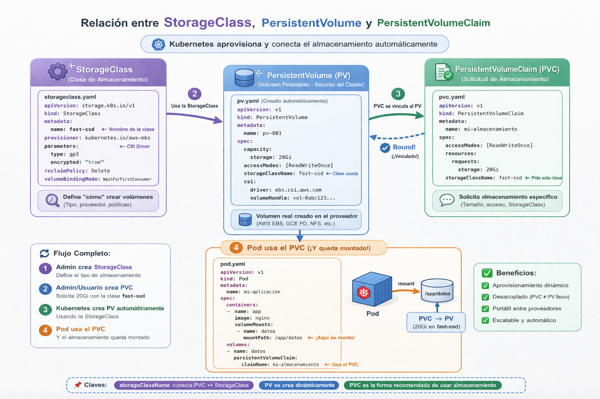

# Almacenamiento

En Kubernetes vamos a encontrar diferentes tipos de almacenamiento, teniendo:

- Volumenes efimeros: Existen junto con el ciclo de vida del Pod, cuando el pod se elimina la informacion desaparece. Teniendo:
  -  emptyDir
  -  configMap
  -  secret
  -  downwardAPI
  -  projected
  -  ephemeral
- Volumenes persistente: Existen mas alla del ciclo de vida del Pod.
  - hostPath
  - nfs
  - iscsi
  - cephfs
  - glusterfs
  - CSI volumes
  - Volúmenes de proveedores cloud: AWS, GCP, Azure 

 ## Volumenes persistentes

- PV = PersistentVolume
  - Objetos de Kubernetes que representan volúmenes de almacenamiento dentro del clúster
- PVC = PersistentVolumeClaim
  - Objeto de Kubernetes utilizado para solicitar almacenamiento a un PV
  - Vincula un PV y permite montarlo en un pod
  - La Política de Recuperación define la acción que se debe realizar sobre el PV cuando se elimina un PVC
    - Conservar: recuperación manual
    - Reciclar: recuperación automática mediante limpieza básica (rm -rf /elvolumen/*)
    - Eliminar: elimina el volumen
- Clases de Almacenamiento
    - Definen el tipo y las propiedades de los volúmenes de almacenamiento disponibles dentro del clúster

# Container Storage Interface

Antes de CSI, Kubernetes tenía drivers de almacenamiento integrados en su propio código.

Problemas de ese enfoque:

- Cada proveedor tenía que modificar Kubernetes.
- Era difícil mantener los plugins.
- Las actualizaciones de almacenamiento dependían de Kubernetes.

Con CSI, el almacenamiento se vuelve extensible y desacoplado. Ahora los proveedores crean drivers CSI independientes.

## ¿Cómo funciona CSI?

CSI define una interfaz (API) entre Kubernetes y el sistema de almacenamiento

Flujo simplificado:

1 Se crea un Kubernetes Persistent Volume Claim
2 Kubernetes solicita almacenamiento al driver CSI
3 El driver CSI crea el volumen en el sistema de almacenamiento
4 Kubernetes lo monta en el Pod

