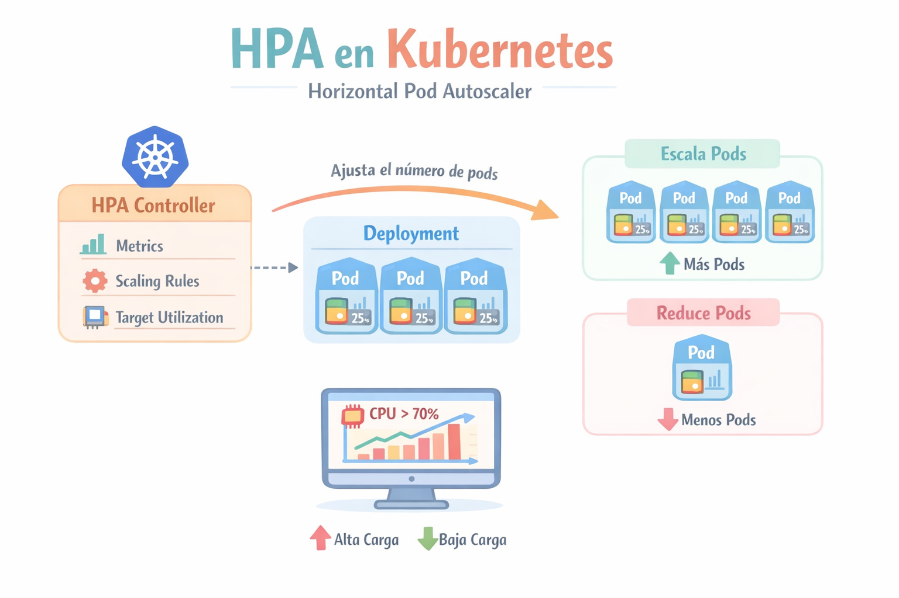
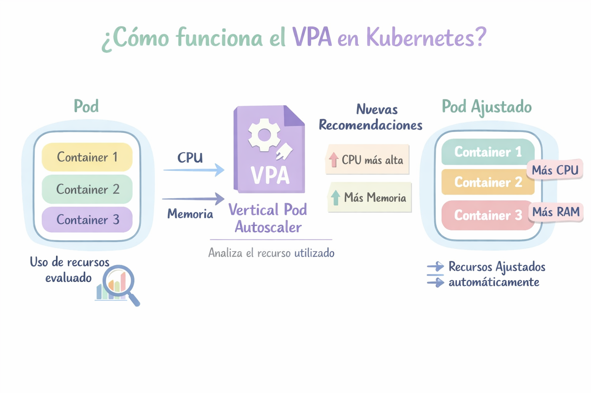
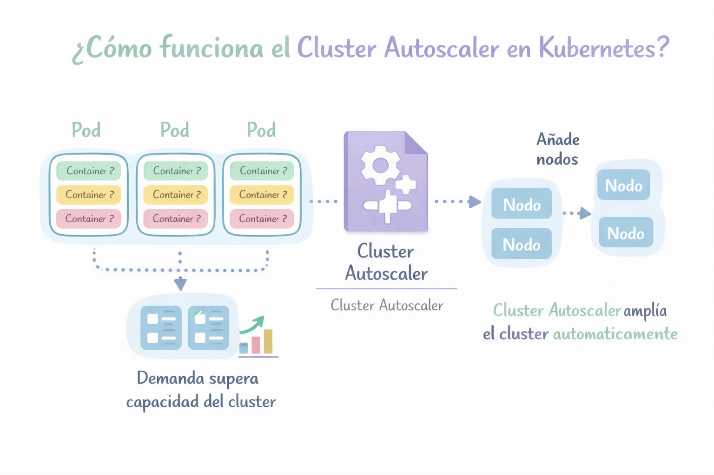
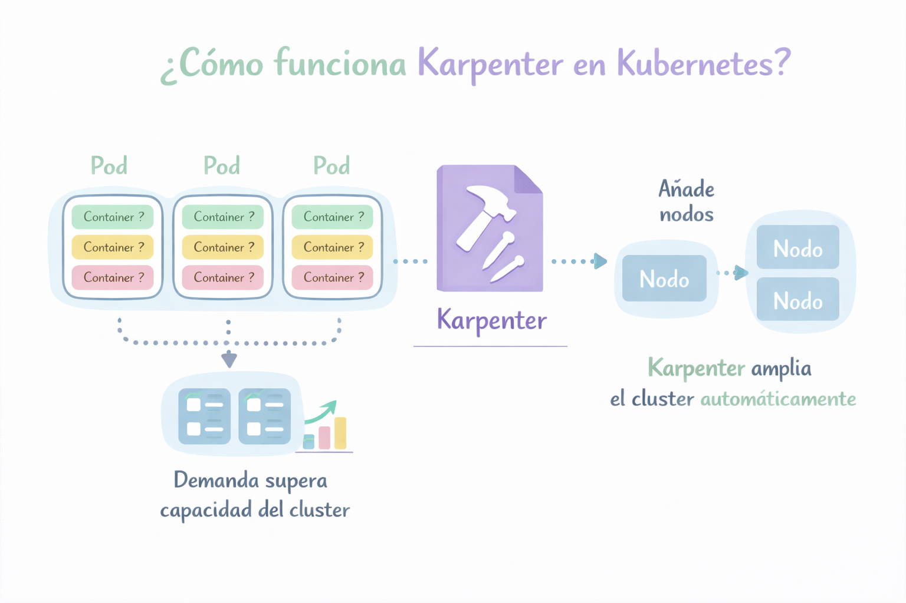
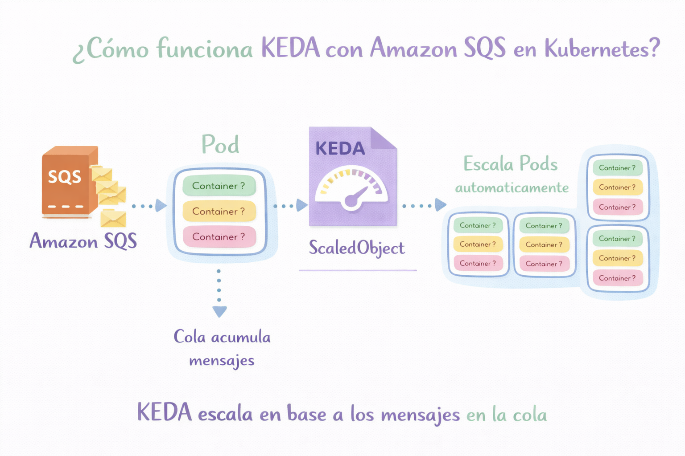

# Escalamiento

En Kubernetes existen dos mecanismos de autoescalado de pods importantes para optimizar recursos:

- HPA (Horizontal Pod Autoscaler)
- VPA (Vertical Pod Autoscaler)

## HPA — Horizontal Pod Autoscaler

El Horizontal Pod Autoscaler ajusta la cantidad de Pods de una aplicación según el uso de recursos (más o menos Pods).

```
apiVersion: autoscaling/v2
kind: HorizontalPodAutoscaler
metadata:
  name: web-hpa
spec:
  scaleTargetRef:
    apiVersion: apps/v1
    kind: Deployment
    name: web-app
  minReplicas: 2
  maxReplicas: 10
  metrics:
  - type: Resource
    resource:
      name: cpu
      target:
        type: Utilization
        averageUtilization: 50
```

<p align="center">

</p>

## VPA — Vertical Pod Autoscaler

El Vertical Pod Autoscaler ajusta los recursos asignados al Pod (más CPU o memoria).

En lugar de crear Pods nuevos, aumenta o reduce los recursos del Pod.

<p align="center">

</p>

## Cluster Autoscaler

El Cluster Autoscaler se encarga de ajustar automáticamente la cantidad de nodos en un clúster según la demanda de recursos.

Agrega nodos cuando no hay suficiente capacidad para ejecutar Pods.

- Elimina nodos cuando están infrautilizados.
- Esto permite optimizar costos y recursos.

<p align="center">

</p>

## Karpenter

Karpenter es una herramienta de autoscaling para nodos en Kubernetes, diseñada para crear nodos automáticamente cuando los Pods necesitan recursos. Desarrollado por Amazon Web Services.

Cómo funciona:

1 Observa Pods que no pueden programarse (estado Pending).

2 Calcula el tipo de nodo necesario.

3 Lanza automáticamente una instancia que cumpla los requisitos.

Optimización inteligente, elige automáticamente:

- tipo de instancia
- CPU
- memoria
- arquitectura.

Es una alternativa más avanzada al Cluster Autoscaler.

<p align="center">

</p>

## KEDA

Es un sistema de autoscaling basado en eventos para Kubernetes.

Escala Pods horizontalmente (similar al Horizontal Pod Autoscaler)

Basado en eventos, Puede escalar según:

- Mensajes en colas
- Tamaño de una cola
- Eventos de streaming
- Métricas externas.

Ejemplos de fuentes de eventos

- Apache Kafka
- RabbitMQ
- Redis
- Amazon Simple Queue Service
- Azure Service Bus

<p align="center">

</p>
