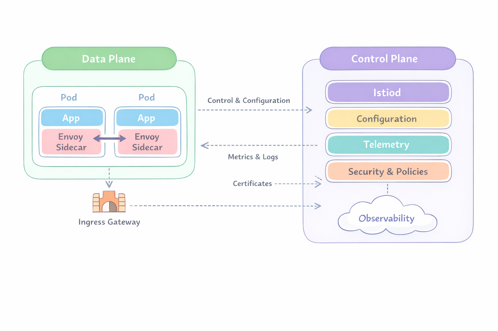

# Service mesh

Un Service Mesh es una capa de infraestructura dedicada a manejar la comunicación entre microservicios.

En vez de que cada aplicación implemente:
- Retries
- Timeouts
- Seguridad (mTLS)
- Observabilidad

Lo delegas a una capa externa.

Un service mesh saca la lógica de red fuera del código de la app

## ¿Qué es Istio?

Istio es uno de los service mesh más populares en Kubernetes.

Istio se basa en dos planos principales:

### 1. Control Plane (Plano de control)

El “cerebro” del sistema

- Componente principal: Istiod

Función:

- configura los proxies
- distribuye reglas
- gestiona certificados (mTLS)

### 2. Data Plane (Plano de datos)

Aquí ocurre el tráfico real

- Usa proxies Envoy
- Se ejecutan como sidecars en cada pod

Función:

- interceptar tráfico
- aplicar reglas (retry, routing, etc.)

