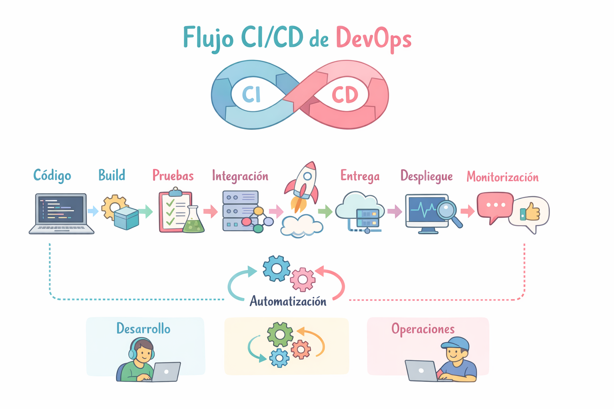
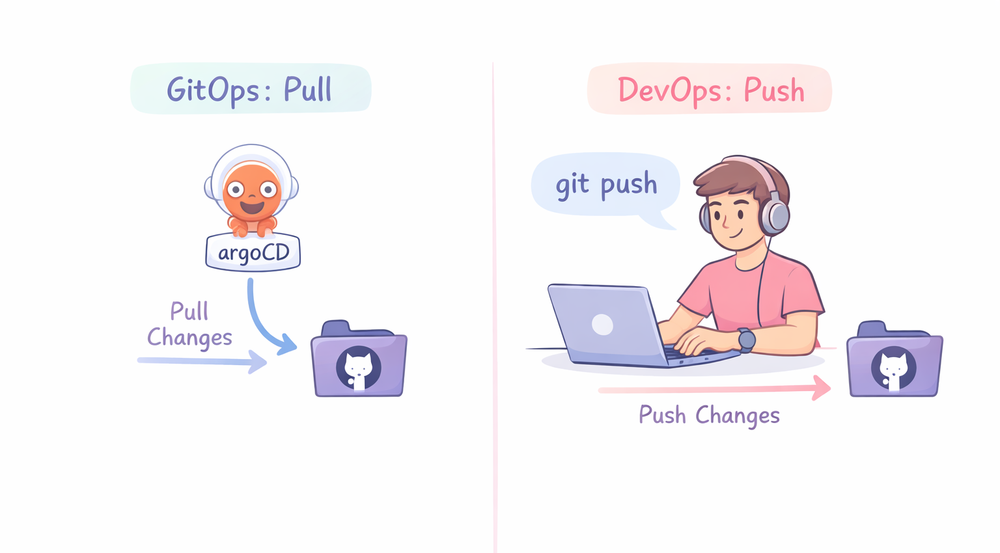

# Cloud Native Application Delivery

Cloud Native Application Delivery es el proceso de construir, desplegar, actualizar y operar aplicaciones diseñadas para entornos cloud-native, usando automatización, contenedores y plataformas modernas para entregar software rápidamente, de forma confiable y escalable.

## Qué incluye el Cloud Native Application Delivery

El proceso normalmente incluye varios componentes:

1. **Empaquetado de aplicaciones:** Las aplicaciones se empaquetan en contenedores.
2. **Orquestación:** Un sistema gestiona los contenedores y su escalado.
3. **Integración y entrega continua:** Automatiza el proceso de construir y desplegar aplicaciones.
4. **Gestión de configuraciones:** Permite manejar configuraciones y secretos.
5. **Observabilidad:** Permite monitorear el sistema para detectar problemas.

## CI/CD

Automatiza el proceso de compilación, prueba y despliegue.

- Integración continua (CI): compila y prueba automáticamente los cambios de código al confirmarlos en el repositorio Git.
- Entrega continua (CD): implementa automáticamente en entornos de prueba o preproducción.
- Despliegue continuo (CD): implementa automáticamente en producción (sin intervención manual).

## DevOps

DevOps es una cultura + prácticas + herramientas que buscan:

- Integrar desarrollo (Dev) y operaciones (Ops) para entregar software más rápido y con mejor calidad.

¿Qué incluye DevOps?

1. Integración continua (CI): Cada cambio se prueba automáticamente
2. Entrega continua (CD): Deploy automatizado
3. Infraestructura como código (IaC): Usas código para crear infra (Terraform, CloudFormation)
4. Observabilidad: logs, métricas, alertas

## GitOps

GitOps es una forma específica de hacer DevOps, basada en una idea simple: "Git es la fuente de verdad (source of truth)"

Todo el sistema (apps + infraestructura) se define en Git

¿Cómo funciona GitOps?

1. Defines el estado deseado en Git (YAML, configs)
2. Haces commit
3. Un operador (ej: ArgoCD) detecta cambios
4. Aplica cambios al cluster automáticamente

### Pull vs Push (clave)

DevOps tradicional (push)
- CI/CD hace deploy directo al cluster

GitOps (pull)
- El cluster jala (pull) los cambios desde Git

### ArgoCD 

Argo CD es una herramienta de GitOps para Kubernetes, sirve para desplegar y mantener aplicaciones sincronizadas usando Git como fuente de verdad.

¿Cómo funciona?

1. Tú haces cambios en Git (YAML, Helm, etc.)
2. Argo CD detecta esos cambios
3. Compara:
  - estado en Git (desired)
  - estado en el cluster (actual)
4. Si hay diferencia → sincroniza automáticamente

### FluxCD

FluxCD es una herramienta de GitOps para Kubernetes que sincroniza automáticamente tu cluster con lo que tienes en Git

¿Cómo funciona?

1. Tú haces cambios en Git (YAML, Helm, etc.)
2. Argo CD detecta esos cambios
3. Compara:
  - estado en Git (desired)
  - estado en el cluster (actual)
4. Si hay diferencia → sincroniza automáticamente

### FluxCD vs ArgoCD

| Feature | FluxCD | Argo CD | 
| ----------------- | ----------------- | -------------- | 
| UI | Ninguna | completa | 
| Arquitectura | modular | más monolítica | 
| Filosofía | Kubernetes-native | user-friendly | 
| Instalación | ligera | más pesada | 
| Curva aprendizaje | más técnica | más fácil |
